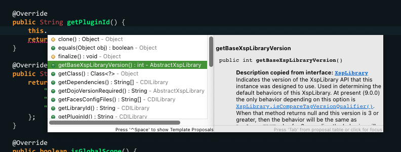

# XPages Javadoc Contributor

This project contains a plugin for Eclipse and Domino Designer that provides Javadoc for several of the standard libraries present in the XPages stack.

This Javadoc is specifically the published documentation referenced [in the Domino Designer wiki](https://ds_infolib.hcltechsw.com/ldd/ddwiki.nsf/dx/Domino_Designer_Extensibility_APIs_Javadoc_9.0.1), with the information corresponding to Domino 9.0.1.

Currently, the Javadoc is referenced via its hosted location on IBM's software servers and thus it is possible that they will remove it at any time. If HCL hosts the documentation on their side (or licenses it for redistribution), I will be able to change this project to not depend on IBM.

## Usage

Once installed, Javadoc for the covered classes should automatically appear when using bundle dependencies in a PDE (plug-in) project or an NSF:

On first use, it may take a few moments for the remote Javadoc to load.

## Coverage

The libraries that have some or all of their classes covered in the published Javadoc are:

- com.ibm.commons
- com.ibm.commons.iloader
- com.ibm.commons.jdbc
- com.ibm.commons.swt
- com.ibm.commons.swt.data
- com.ibm.commons.xml
- com.ibm.designer.domino.ide.resources
- com.ibm.designer.domino.scripting
- com.ibm.designer.domino.xsp.editor
- com.ibm.designer.domino.xsp.editor
- com.ibm.xsp.core
- com.ibm.xsp.designer
- com.ibm.xsp.domino